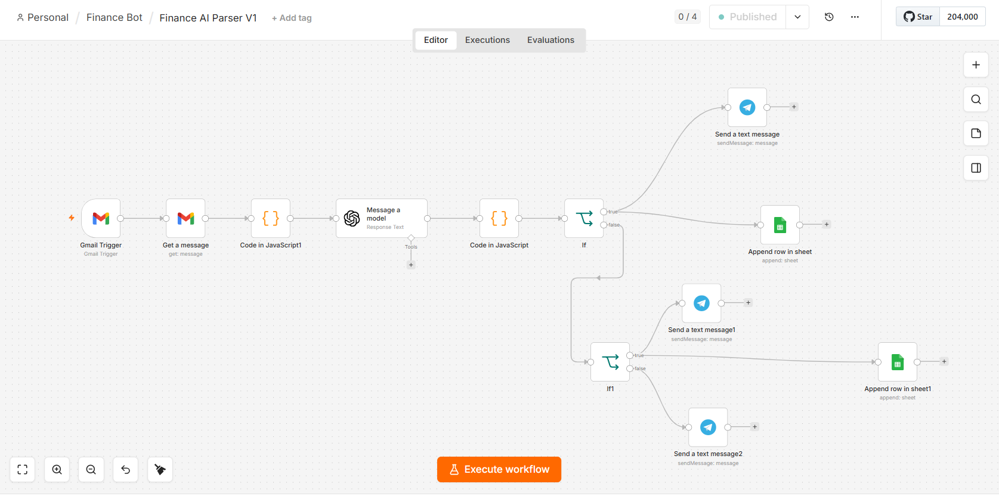
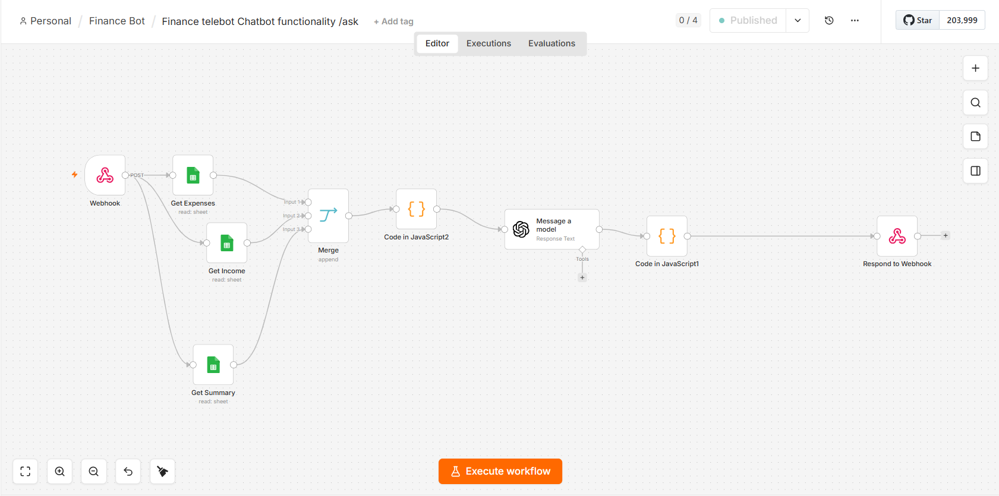
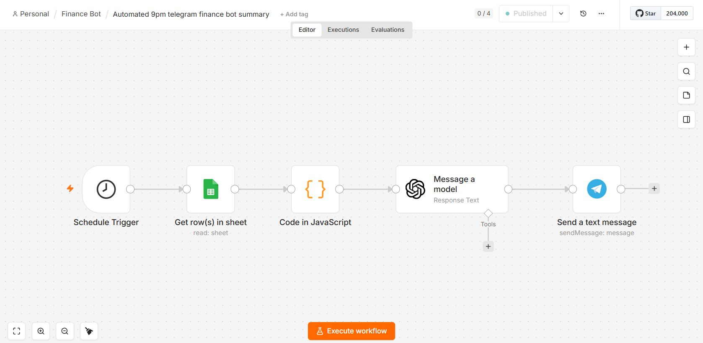

# AI Finance Automation Platform

A personal finance automation project I built using n8n, OpenAI and various APIs. The goal was to automate some of the repetitive parts of tracking and reviewing my finances.

## What it does

### 1. AI Transaction Parser

Automatically processes banking notification emails and uses OpenAI to extract transaction details. The workflow then categorises the transaction as an expense or income, records it in Google Sheets, and sends a notification through Telegram.



### 2. AI Finance Assistant

An AI assistant that lets me ask questions about my financial data using natural language. It retrieves expense, income and summary data from Google Sheets and uses OpenAI to generate a response.



### 3. Daily Finance Summary

A scheduled workflow that runs at 9 PM, retrieves recent expense data, generates a spending summary using AI, and sends it to Telegram.



## Workflow Overview

The platform connects multiple services into end-to-end automated workflows:

```text
Gmail
  ↓
n8n
  ↓
OpenAI
  ↓
Process & analyse data
  ↓
Google Sheets
  ↓
Telegram
